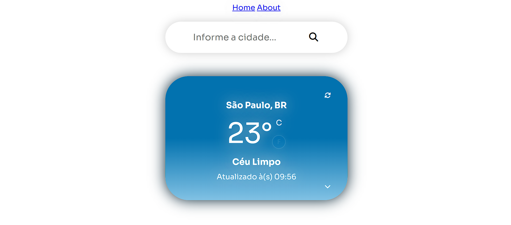
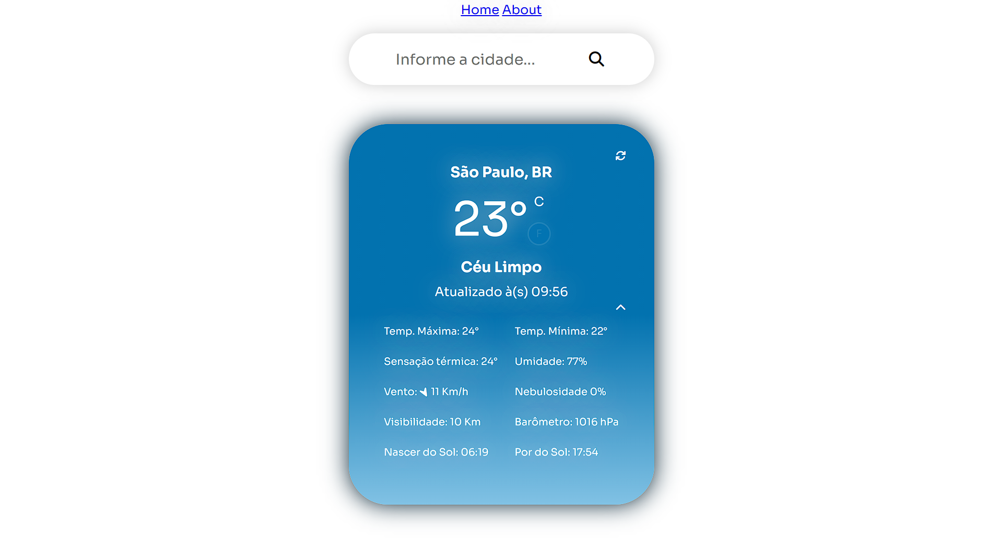
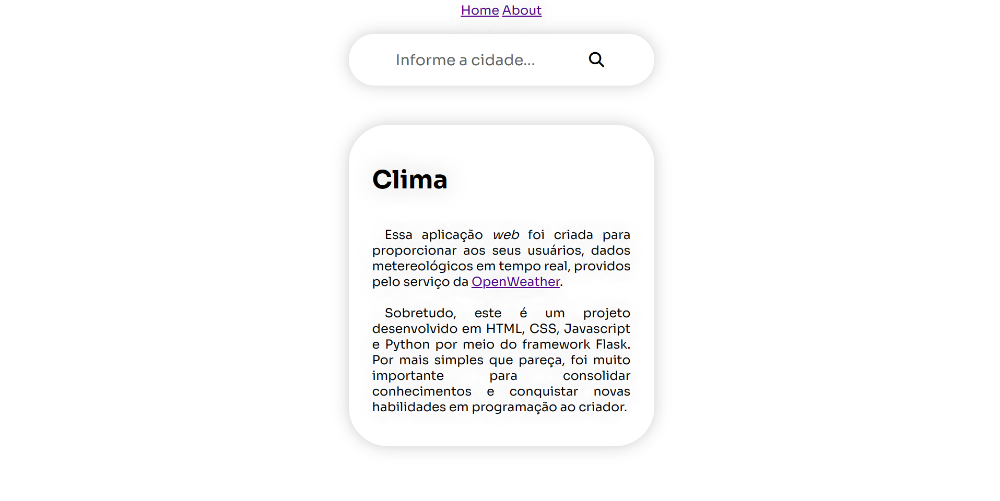

# Clima - Flask

[](https://img.shields.io/)
[](https://img.shields.io/)

## Sumário

* [Introdução](#introdução)
* [Contexto](#contexto)
* [Critérios](#critérios)
* [Roadmap](#roadmap)
  * [HTML e CSS](#html-e-css)
  * [Javascript](#javascript)
  * [Flask e Python](#flask-e-python)

## Introdução

Esse arquivo foi criado para proporcionar ao desenvolvedor e às pessoas que acompanharem o projeto, uma perspectiva/roadmap do desenvolvimento do produto.

## Contexto

Há algum tempo, decidi criar uma aplicação com interface gráfica em Python capaz de obter dados climáticos em tempo real. Confesso que gostei muito do resultado, que pode ser conferido no repositório [github.com/MacS47/Clima](https://github.com/MacS47/Clima). Com o passar do tempo encontrei a oportunidade de melhorar o app.

Assim esse projeto nasceu: uma aplicação desenvolvida em [Flask](https://flask.palletsprojects.com/en/2.2.x/quickstart/), que aproveita conhecimentos adquiridos em HTML, CSS, Javascript e Python3 para entregar dados climáticos em tempo real.

## Critérios

Os critérios para construção da aplicação são os seguintes:

* Ser uma aplicação web;
* Ser responsiva, capaz de ser utilizada em qualquer dispositivo;
* Aproveitar os recursos de do framework Flask para;
* Utilizar os recursos da API da OpenWeather;

> Novos critérios podem ser incluídos ao longo do tempo.

## Utilização

Como esse projeto consome uma API, se faz necessário criar um chave para acesso aos dados climáticos.

Ao abrir o projeto é possível verificar que foi importado `TOKEN` da biblioteca `environment`. Essa biblioteca foi criada no dispositivo local, mas pode ser substituída por outra chave...

De todo modo, após realizar essas definições, basta executar o arquivo `app.py`. Será exibido o seguinte:

```bash
 * Serving Flask app 'app'
 * Debug mode: on
 WARNING: This is a development server. Do not use it in a production deployment. Use a production WSGI server instead.
 * Running on http://127.0.0.1:5000
 Press CTRL+C to quit
 * Restarting with stat
 * Debugger is active!
 * Debugger PIN: 117-460-869
```

Depois disso basta clicar no link `http://127.0.0.1:5000` e você será redirecionado à página da aplicação.

A aplicação é composta por três rotas:

* Home


* Weather



* About


## Roadmap

### **HTML e CSS**

* [x] Desenvolver o HTML, CSS e Javascript do projeto - 03/04/2023;
* Páginas:
  * [x] Home - 06/04/2023;
  * [x] Weather - 06/04/2023;
  * [x] About - 10/04/2023;
* [ ] Criar `menu` com os links para Home, Weather e About;
* [ ] Criar `footer` com dados sobre o desenvolvedor;
* [x] Criar botão atualizar, que permita o usuário atualizar o card de temperatura - 09/04/2023;
* [x] Criar o botão minimizar, que possibilite ao usuário diminuir o tamanho do card de exibição de temperatura 10/04/2023;
* [ ] Incluir dados de precipitação na tabela de estatísticas;

### **Javascript**

* [x] Criar a função que realizará a manipulação do estilo do card, o qual exibirá a temperatura, baseado na hora do dia - 06/04/2023;
* [x] Criar a função responsável por converter valores de graus Celsius para graus Fahrenheit - 07/04/2023;
* [x] Criar a função que realizará alterações no estilo do ícone que indica a direção do vento - 08/04/2023;
* [x] Criar a função que atualizará os dados do card de temperatura - 10/04/2023;
* [x] Criar a função que expande a visualização do card trazendo dados estatísticos 10/04/2023;

### **Flask e Python**

* [x] Desenvolver a aplicação em Flask que utilizará os recursos pré-estabelecidos em HTML, CSS e Javascript - 05/04/2023;
* [x] Criar as rotas em Flask e os redirecionamentos de acordo com os dados fornecidos pelos usuários;
  * [x] Rota `index` - 06/04/2023
  * [x] Rota `index, method = 'POST'` - 06/04/2023
  * [x] Rota `weather` - 06/04/2023
  * [x] Rota `weather/<city_name>` - 06/04/2023
  * [x] Rota `about` - 08/04/2023
  * [x] Rota `home` - 10/04/2023
* [x] Configurar a aplicação para consumir a API da OpenWeather - 05/04/2023;
* [x] Criar método POST para obter a cidade informada pelo usuário(a) - 07/04/20223;
* [ ] Incluir dados de precipitação da API;
